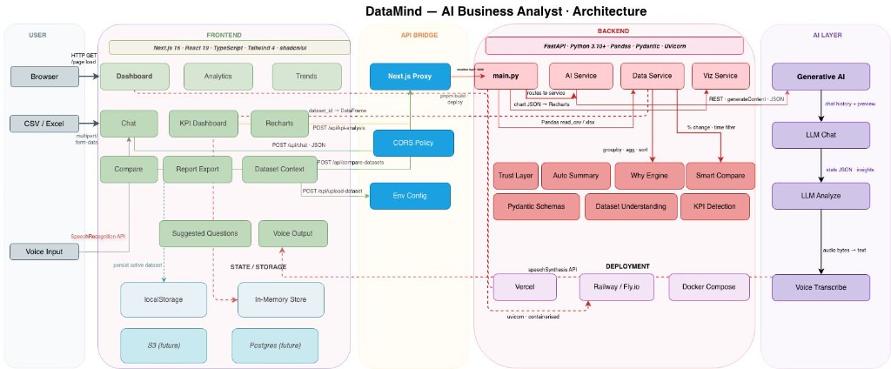
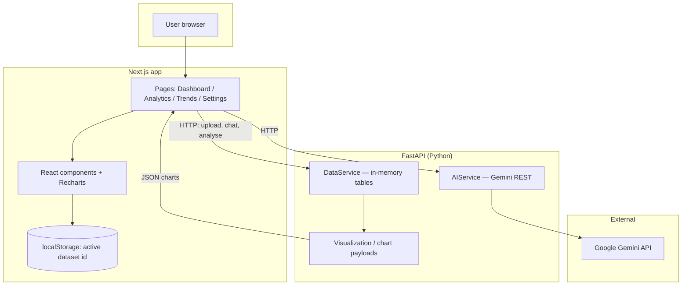
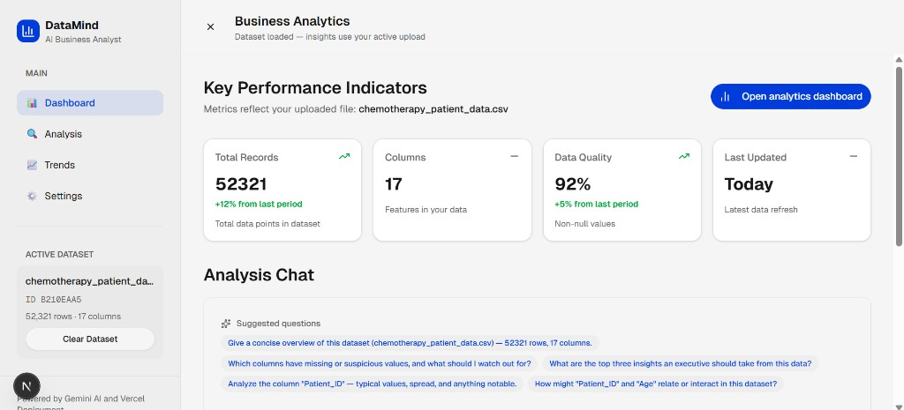
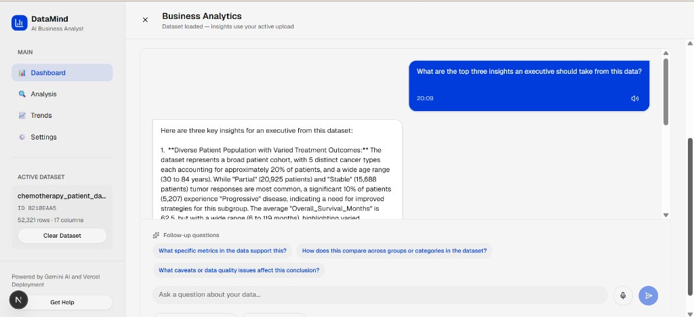
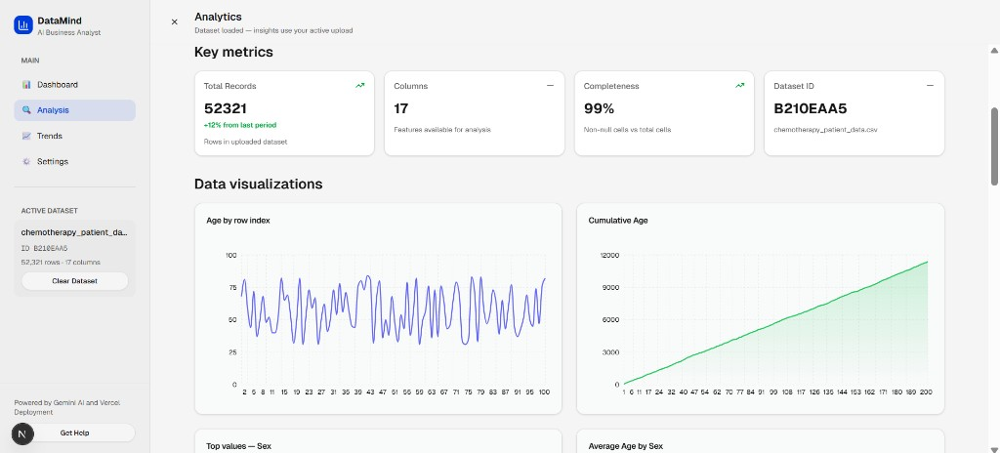
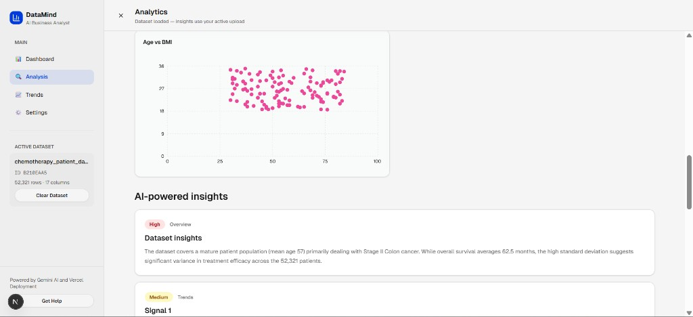
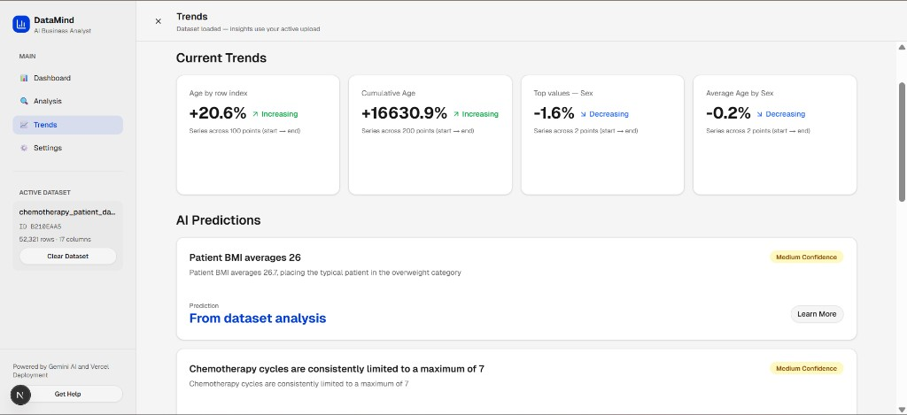
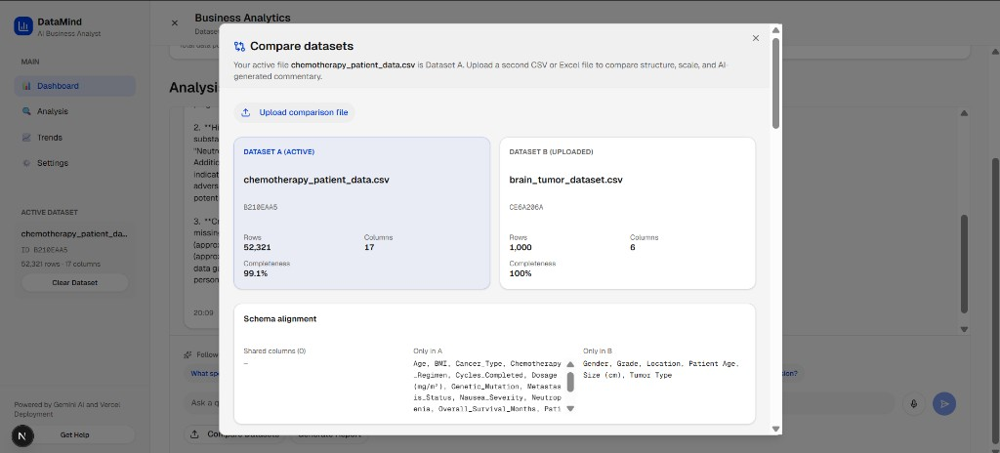
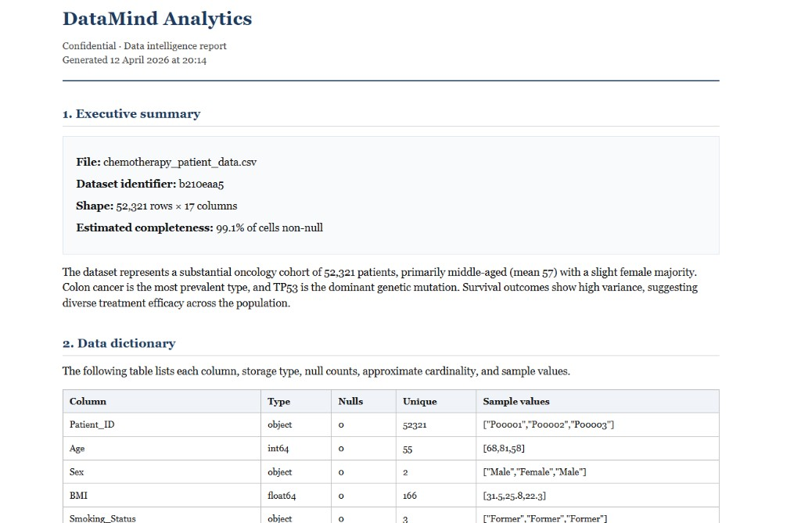

<div align="center">

# DataMind

### Your AI teammate for spreadsheets

**Upload a file · Ask in plain English · Get charts, KPIs, and exportable reports**

[](https://fastapi.tiangolo.com/)
[](https://nextjs.org/)
[](https://ai.google.dev/)

</div>

---

## Who is this for?

| Audience | What you’ll find here |
|----------|------------------------|
| **Everyone** | A short overview, pictures of the product, and what problem we solve — no code required. |
| **Judges & reviewers** | Clear install steps, honest feature list, architecture, limitations, and how to verify the app works. |
| **Developers** | Tech stack, folder layout, API overview, and environment variables (with `.env.example` — never real secrets). |

---

## Table of contents

1. [Overview](#overview)  
2. [Screenshots & visuals](#screenshots--visuals)  
3. [Features (implemented)](#features-implemented)  
4. [How it works (simple)](#how-it-works-simple)  
5. [Tech stack](#tech-stack)  
6. [Folder structure](#folder-structure)  
7. [Install & run](#install--run)  
8. [Usage examples](#usage-examples)  
9. [Architecture & data flow](#architecture--data-flow)  
10. [API reference (short)](#api-reference-short)  
11. [Configuration](#configuration)  
12. [Limitations & honesty](#limitations--honesty)  
13. [Future improvements](#future-improvements)  
14. [Hackathon / submission notes](#hackathon--submission-notes)  
15. [License & team](#license--team)  

---

## Overview

**DataMind** is a web application that helps people understand **CSV and Excel** data without writing formulas or code. You **upload** a file, **chat** in natural language (powered by **Google Gemini**), and explore **automatic charts**, **KPI-style summaries**, **trend views**, and **downloadable HTML reports**. You can also **compare two datasets** side by side and get a structured diff plus an optional AI narrative.

**Problem it solves:** Business and student users often have data in spreadsheets but lack time or skills to analyse it deeply. DataMind lowers the barrier by combining familiar file upload with an AI analyst and clear visuals.

**Who it’s for:** Students, analysts, founders, and hackathon judges who want a **working end-to-end demo**: real file → real stats → real LLM responses (when an API key is configured).

---

## Screenshots & visuals

Product screenshots and the architecture diagram are stored under **`docs/images/`** as PNG files. Paths in this section are **relative to the repository root** (e.g. `docs/images/flow-architecture.png`) so they render on **GitHub** and in the **VS Code / Cursor Markdown preview**.

**If images look broken:** confirm the eight `.png` files exist locally, then **commit and push** them — the README only links to files in the repo; they are not hosted elsewhere.

### Flow & architecture (combined figure)

End-to-end **user journey** (browser → Next.js → FastAPI → Gemini & data) and **system structure** in one diagram.



### Architecture diagram (Mermaid — renders on GitHub)



### Product walkthrough *(7 screens)*

#### 1 · Dashboard — KPIs & quick actions



#### 2 · Dashboard — AI analysis chat



#### 3 · Analytics — key metrics & line charts



#### 4 · Analytics — scatter plot & AI-powered insights



#### 5 · Trends — dataset-driven signals



#### 6 · Compare datasets — schema & scale



#### 7 · Formal HTML report — executive summary & data dictionary



---

## Features (implemented)

These are **in the codebase and working** today (with a valid Gemini key where noted):

- **File upload** — CSV and Excel (`.csv`, `.xlsx`, `.xls`) via the dashboard; server returns a `dataset_id`.
- **AI chat** — Ask questions about the **active** dataset; the backend attaches **dataset metadata** and a **tabular preview** to the model context.
- **KPI-style dashboard** — Summary cards driven by dataset stats on the home view.
- **Dataset analysis** — `POST /analyze-dataset` returns structured fields such as insights, trends, recommendations, and anomalies (exact shape depends on the model response).
- **Analytics page** — Fetches dataset info, chart JSON, and analysis; **Recharts** visualisations; **export** opens the formal **HTML report** dialog.
- **Trends page** — Dataset-driven trend cards, sparklines from chart data, AI text when available, and **data-driven fallbacks** when the model returns empty fields.
- **Compare datasets** — Upload a second file, compare schema and numeric overlap, side-by-side charts, **download comparison HTML report**.
- **Formal HTML reports** — Client-side HTML build + download for single-dataset and comparison reports.
- **Voice API** — Backend endpoints for **speech-to-text** and **text-to-speech** (Gemini); UI may use browser speech where implemented.
- **Active dataset persistence** — Selected dataset id stored in **localStorage** so refresh keeps context (server-side data still lives in memory — see [limitations](#limitations--honesty)).
- **API documentation** — Interactive **Swagger** at `/docs` when the Python server is running.
- **Docker Compose** — Optional one-command bring-up of API + frontend (see [Install & run](#install--run)).

We **do not** claim features that are not wired in the UI or API. If something is partial, it is called out under [limitations](#limitations--honesty).

---

## How it works (simple)

1. You open the **web app** and **upload** a spreadsheet.  
2. The **Python service** reads the file with **Pandas**, stores it **in memory**, and gives back an id.  
3. The **browser** remembers that id and calls the API for **info**, **charts**, and **AI analysis**.  
4. **Gemini** reads a **text summary** of your data (not the whole file at once) and answers chat or analysis prompts.  
5. You can **export HTML reports** or **compare** against a second upload.

---

## Tech stack

| Area | Technologies |
|------|----------------|
| **Languages** | TypeScript, Python 3.10+ |
| **Frontend** | Next.js (App Router), React 19, Tailwind CSS, Radix / shadcn-style UI, Recharts |
| **Backend** | FastAPI, Pandas, Pydantic |
| **AI / ML** | Google **Gemini** via REST (`generateContent`); optional model fallbacks in `AIService` |
| **Data storage** | **In-memory** per server process (no PostgreSQL/Mongo required for the demo) |
| **Cloud / deploy** | Environment-based config; frontend can sit on Vercel; API on any Python host; **Docker Compose** for local full stack |
| **Voice** | Server endpoints using Gemini; browser **Web Speech** where applicable |

---

## Folder structure

Logical layout (high level — avoids a single “god file” for all logic):

```text
project/
├── app/                    # Next.js routes & layouts (dashboard, analytics, trends, settings)
├── components/             # UI: chat, upload, KPIs, dialogs, shell
├── contexts/               # React context (e.g. active dataset + localStorage)
├── lib/                    # Shared TS helpers (reports, suggestions, …)
├── docs/
│   └── images/             # README screenshots (see docs/images/README.md)
├── api/                    # Python FastAPI service
│   ├── main.py             # HTTP routes
│   ├── services/           # AI, data, visualization logic
│   ├── models/             # Pydantic schemas
│   └── requirements.txt
├── .env.example            # Frontend env template (no secrets)
├── docker-compose.yml      # Optional: API + web
└── README.md               # This file
```

---

## Install & run

### Prerequisites

- **Node.js** 18+ (20+ recommended)  
- **Python** 3.10+  
- **pnpm**, **npm**, or **yarn**  
- A **Google Gemini API key** ([Google AI Studio](https://aistudio.google.com/)) — optional for UI-only exploration; **required** for real AI responses  

### 1. Clone the repository

```bash
git clone <your-repo-url>
cd <project-folder>
```

### 2. Install dependencies

**Frontend (repository root):**

```bash
pnpm install
# or: npm install
```

**Backend:**

```bash
cd api
python -m venv venv

# Windows
venv\Scripts\activate

# macOS / Linux
source venv/bin/activate

pip install -r requirements.txt
cd ..
```

### 3. Configure environment (no secrets in git)

```bash
copy .env.example .env.local          # Windows: copy
# cp .env.example .env.local          # macOS / Linux

copy api\.env.example api\.env        # Windows
# cp api/.env.example api/.env        # macOS / Linux
```

- Put **`GEMINI_API_KEY`** (or **`GOOGLE_API_KEY`**) in **`api/.env`**.  
- In **`.env.local`**, set for local dev (typical):

```env
NEXT_PUBLIC_API_URL=/api
```

The Next.js dev server can **rewrite** `/api/*` to your FastAPI server (default `http://127.0.0.1:8000`). Override with **`API_PYTHON_URL`** if needed. See `next.config.mjs`.

### 4. Run the application

**Option A — Docker Compose (full stack)**

```bash
docker compose up
```

- App: **http://localhost:3000**  
- API: **http://localhost:8000**  
- Docs: **http://localhost:8000/docs**  

**Option B — Two terminals (common for development)**

Terminal 1 — **FastAPI:**

```bash
cd api
venv\Scripts\activate
python main.py
# or: uvicorn main:app --reload --host 0.0.0.0 --port 8000
```

Terminal 2 — **Next.js:**

```bash
pnpm dev
# or: npm run dev
```

Open **http://localhost:3000**.

### 5. Quick health check

```bash
curl http://localhost:8000/health
```

You should see JSON with `"status": "healthy"` and service flags.

---

## Usage examples

### In the browser (non-technical)

1. Go to the **Dashboard**.  
2. **Upload** a `.csv` or Excel file.  
3. Wait for KPIs / chat to reflect the **active** file.  
4. Try a question like: *“What are the main columns and any quality issues?”*  
5. Open **Analytics** or **Trends** for charts and narrative.  
6. Use **Compare datasets** or **Generate report** if those actions appear in your build.

### Example API calls (technical)

**Upload** (from repo root; adjust path to a real file):

```bash
curl -X POST http://localhost:8000/upload-dataset -F "file=@./sample.csv"
```

**Chat** (minimal body):

```bash
curl -X POST http://localhost:8000/chat ^
  -H "Content-Type: application/json" ^
  -d "{\"message\":\"Summarise this dataset in 3 bullet points.\",\"dataset_id\":\"YOUR_DATASET_ID\"}"
```

> **Note:** The FastAPI app exposes routes at the **root** of its origin (e.g. `/chat`). If the browser uses `NEXT_PUBLIC_API_URL=/api`, Next.js **proxies** `/api/chat` → `http://127.0.0.1:8000/chat` in development.

**Analyse:**

```bash
curl -X POST http://localhost:8000/analyze-dataset ^
  -H "Content-Type: application/json" ^
  -d "{\"dataset_id\":\"YOUR_DATASET_ID\",\"analysis_type\":\"comprehensive\"}"
```

More endpoints: **`/dataset-info/{id}`**, **`/dataset-charts/{id}`**, **`/compare-datasets`**, **`/kpi-analysis`**, **`/voice-transcribe`**, **`/voice-synthesis`** — see **http://localhost:8000/docs**.

---

## Architecture & data flow

1. **Browser** loads the Next.js app and may store **active `dataset_id`** in `localStorage`.  
2. **Client** calls the API (direct URL or `/api` rewrite) for upload, chat, and analysis.  
3. **FastAPI** uses **Pandas** to parse files and **AIService** to call **Gemini** with **summaries** and **previews** (not unlimited full-file dumps).  
4. **Chart payloads** are JSON consumed by **Recharts** on the frontend.  
5. **Reports** are built as **HTML** in the client for download.

For a visual, see the [Mermaid diagram](#screenshots--visuals) and the combined figure placeholder above.

---

## API reference (short)

| Method | Path | Purpose |
|--------|------|---------|
| `GET` | `/health` | Health check |
| `POST` | `/chat` | Conversational AI; optional `dataset_id` enriches context |
| `POST` | `/upload-dataset` | Multipart file upload |
| `POST` | `/analyze-dataset` | AI + structured analysis object |
| `GET` | `/dataset-info/{id}` | Rows, columns, nulls per column |
| `GET` | `/dataset-numeric-summary/{id}` | Numeric summary text |
| `GET` | `/dataset-charts/{id}` | JSON for charts |
| `POST` | `/compare-datasets` | Two ids → comparison + snapshot |
| `POST` | `/kpi-analysis` | KPI-oriented analysis |
| `POST` | `/voice-transcribe` | Audio → text |
| `POST` | `/voice-synthesis` | Text → audio |

Full schemas: **`/docs`** (Swagger).

---

## Configuration

| Variable | Where | Purpose |
|----------|--------|---------|
| `GEMINI_API_KEY` or `GOOGLE_API_KEY` | `api/.env` | Gemini access |
| `GEMINI_MODEL`, `GEMINI_MODEL_FALLBACKS` | `api/.env` | Optional model overrides |
| `NEXT_PUBLIC_API_URL` | `.env.local` | API base URL the browser calls |
| `API_PYTHON_URL` | env / build | Next.js rewrite target for `/api/*` |
| `ALLOWED_ORIGINS`, `DATA_DIR`, … | `api/.env` | Server tuning (see `api/.env.example`) |

**Security:** Never commit real keys. Only commit **`.env.example`** / **`api/.env.example`**.

---

## Limitations & honesty

- **In-memory data:** Restarting the Python process **clears** uploaded datasets. Users must **re-upload** after a server restart unless you add persistence.  
- **Gemini dependency:** Without a valid key, AI features fall back to **demo or error messages** depending on the code path.  
- **Model availability:** Google may change model names; the backend includes **fallback** logic — check logs if you see HTTP 404/429.  
- **Not a full BI suite:** No multi-user auth, row-level security, or warehouse integration in this repo.  
- **Tests:** Automated tests are **not** required by this README; add a `tests/` folder if you want assessment on coverage (see hackathon rules).

This section is intentionally explicit so **judges can trust** what they are evaluating.

---

## Future improvements

Ideas for a **longer runway** (not promised as done today):

- Persistent storage (e.g. **S3** + **PostgreSQL**) for files and metadata  
- User accounts and **OAuth**  
- Streaming chat responses (**SSE** / WebSocket)  
- Stronger automated **tests** and CI  
- Scheduled reports and email delivery  

---

## Hackathon / submission notes

This documentation is structured to align with common **student hackathon README expectations** (clear overview, real features, install steps, tech stack, usage, architecture, honesty):

- **README is accurate** — features listed under [Features (implemented)](#features-implemented) correspond to working paths in the repository.  
- **Secrets** — Use `.env.example` only; do not commit real API keys or passwords.  
- **Original work** — Use third-party libraries under their licences; your **integration, prompts, and UI** should be your team’s own submission.  
- **Repository rules** — Follow the organiser’s policies (e.g. **private repo** during the event, **DCO / sign-off**, **single email**, **Apache 2.0** compatibility if required).  
- **Screenshots** — Add final PNGs per [`docs/images/README.md`](./docs/images/README.md) before final submission.

---

## License & team

- **License:** Include a `LICENSE` file consistent with the hackathon rules (many events use **Apache 2.0** with **DCO**). If this repo has no `LICENSE` yet, add one before submission.  
- **Team:** *[Add your names, handles, and affiliation here.]*  
- **Issues:** Use GitHub **Issues** for bug reports and questions about this repo.

---

<div align="center">

**DataMind** — from spreadsheet to insight, with AI you can actually run locally.

</div>
